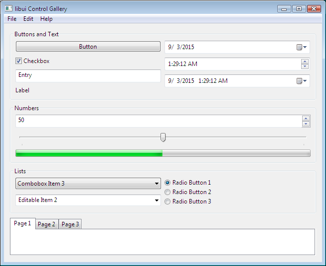
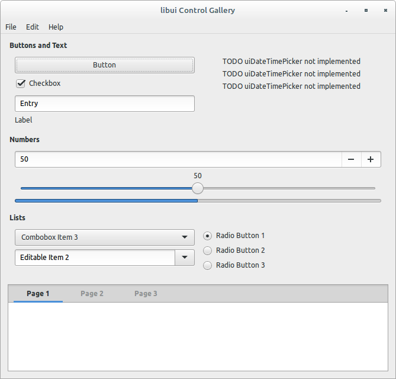
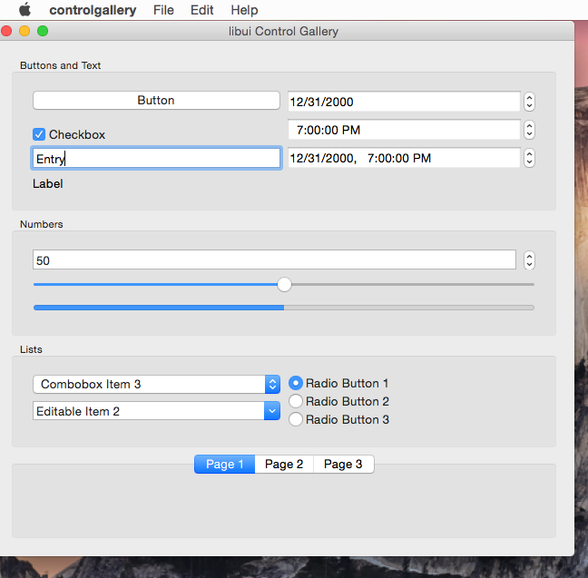

# libui: a portable GUI library for C

This README is being written.<br>
[](https://dev.azure.com/andlabs/libui/_build/latest?definitionId=1&branchName=master)<br>
[](https://ci.appveyor.com/project/andlabs/libui/branch/master)

## Status

It has come to my attention that I have not been particularly clear about how usable or feature-complete libui is, and that this has fooled many people into expecting more from libui right this moment than I have explicitly promised to make available. I apologize for not doing this sooner.

libui is currently **mid-alpha** software. Much of what is currently present runs stabily enough for the examples and perhaps some small programs to work, but the stability is still a work-in-progress, much of what is already there is not feature-complete, some of it will be buggy on certain platforms, and there's a lot of stuff missing. In short, here's a list of features that I would like to add to libui, but that aren't in yet:

- trees
- clipboard support, including drag and drop
- more and better dialogs
- printing
- accessibility for uiArea and custom controls
- document-based programs
- tighter OS integration (especially for document-based programs), to allow programs to fully feel native, rather than merely look and act native
- better support for standard dialogs and features (search bars, etc.)
- OpenGL support

In addition, [here](https://github.com/andlabs/libui/issues?utf8=%E2%9C%93&q=master+in%3Atitle+is%3Aissue+is%3Aopen) is a list of issues generalizing existing problems.

Furthermore, libui is not properly fully documented yet. This is mainly due to the fact that the API was initially unstable enough so as to result in rewriting documentation multiple times, in addition to me not being happy with really any existing C code documentation tool. That being said, I have started to pin down my ideal code documentation style in parts of `ui.h`, most notably in the uiAttributedString APIs. Over time, I plan on extending this to the rest of the headers. You can also use [the documentation for libui's Go bindings](https://godoc.org/github.com/andlabs/ui) as a reference, though it is somewhat stale and not optimally written.

But libui is not dead; I am working on it whenever I can, and I hope to get it to a point of real quality soon!

## News

*Note that today's entry (Eastern Time) may be updated later today.*

* **7 April 2019**
	* **The build system has been switched to Meson.** See below for instructions. This change was made because the previous build system, CMake, caused countless headaches over trivial issues. Meson was chosen due to how unproblematic setting up libui's build just right was, as well as having design goals that are by coincidence closely aligned with what libui wants.
	* Travis CI has been replaced with Azure Pipelines and much of the AppVeyor CI configuration was integrated into the Azure Pipelines configuration. This shouldn't affect most developers.

* **1 September 2018**
	* **Alpha 4.1 is here.** This is an emergency fix to Alpha 4 to fix `uiImageAppend()` not working as documented. It now works properly, with one important difference you'll need to care about: **it now requires image data to be alpha-premultiplied**. In addition, `uiImage` also is implemented slightly more nicely now, and `ui.h` has minor documentation typo fixes.
	* Alpha 4.1 also tries to make everything properly PIC-enabled.

* **10 August 2018**
	* **Alpha 4 is finally here.** Everything from Alpha 3.5 and what's listed below is in this release; the two biggest changes are still the new text drawing API and new uiTable control. In between all that is a whole bunch of bugfixes, and hopefully more stability too. Thanks to everybody who helped contribute!
	* Alpha 4 should hopefully also include automated binary releases via CI. Thanks to those who helped set that up!

* **8 August 2018**
	* Finally introduced an API for loading images, `uiImage`, and a new control, `uiTable`, for displaying tabular data. These provide enough basic functionality for now, but will be improved over time. You can read the documentation for the new features as they are [here](https://github.com/andlabs/libui/blob/f47e1423cf95ad7b1001663f3381b5a819fc67b9/uitable.h). Thanks to everyone who helped get to this point, in particular @bcampbell for the initial Windows code, and to everyone else for their patience!

* **30 May 2018**
	* Merged the previous Announcements and Updates section of this README into a single News section, and merged the respective archive files into a single NEWS.md file.

* **16 May 2018**
	* Thanks to @parro-it and @msink, libui now has better CI, including AppVeyor for Windows CI, and automated creation of binary releases when I make a tagged release.

* **13 May 2018**
	* Added new functions to work with uiDateTimePickers: `uiDateTimePickerTime()`, `uiDateTimePickerSetTime()`, and `uiDateTimePickerOnChanged()`. These operate on standard `<time.h>` `struct tm`s. Thanks @cody271!
	* Release builds on Windows with MSVC should be fixed now; thanks @l0calh05t, @slahn, @mischnic, and @zentner-kyle.

* **12 May 2018**
	* GTK+ and OS X now have a cleaner build process for static libraries which no longer has intermediate files and differing configurations. As a result, certain issues should no longer be present. New naming rules for internal symbols of libui have also started being drafted; runtime symbols and edge cases still need to be handled (and the rules applied to Windows) before this can become a regular thing.

* **2 May 2018**
	* On Windows, you no longer need to carry around a `libui.res` file with static builds. You do need to link in the appropriate manifest file, such as the one in the `windows/` folder (I still need to figure out exactly what is needed apart from the Common Controls v6 dependency, or at least to create a complete-ish template), or at least include it alongside your executables. This also means you should no longer see random cmake errors when building the static libraries.

* **18 April 2018**
	* Introduced a new `uiTimer()` function for running code on a timer on the main thread. (Thanks to @cody271.)
	* Migrated all code in the `common/` directory to use `uipriv` prefixes for everything that isn't `static`. This is the first step toward fixing static library oddities within libui, allowing libui to truly be safely used as either a static library or a shared library.

* **18 March 2018**
	* Introduced an all-new formatted text API that allows you to process formatted text in ways that the old API wouldn't allow. You can read on the whole API [here](https://github.com/andlabs/libui/blob/8944a3fc5528445b9027b1294b6c86bae03eeb89/ui_attrstr.h). There is also a new examples for it: `drawtext`, which shows the whole API at a glance. It doesn't yet support measuring or manipulating text, nor does it currently support functions that would be necessary for things like text editors; all of this will be added back later.
	* libui also now uses my [utf library](https://github.com/andlabs/utf) for UTF-8 and UTF-16 processing, to allow consistent behavior across platforms. This usage is not completely propagated throughout libui, but the Windows port uses it in most places now, and eventually this will become what libui will use throughout.
	* Also introduced a formal set of contribution guidelines, see `CONTRIBUTING.md` for details. They are still WIP.

* **17 February 2018**
	* The longstanding Enter+Escape crashes on Windows have finally been fixed (thanks to @lxn).
	* **Alpha 3.5 is now here.** This is a quickie release primiarly intended to deploy the above fix to package ui itself. **It is a partial binary release; sorry!** More new things will come in the next release, which will also introduce semver (so it will be called v0.4.0 instead).
	* Alpha 3.5 also includes a new control gallery example. The screenshots below have not been updated yet.

*Old announcements can be found in the NEWS.md file.*

## Runtime Requirements

* Windows: Windows Vista SP2 with Platform Update or newer
* Unix: GTK+ 3.10 or newer
* Mac OS X: OS X 10.8 or newer

## Build Requirements

* All platforms:
	* [Meson](https://mesonbuild.com/) 0.48.0 or newer
	* Any of Meson's backends; this section assumes you are using [Ninja](https://ninja-build.org/), but there is no reason the other backends shouldn't work.
* Windows: either
	* Microsoft Visual Studio 2013 or newer (2013 is needed for `va_copy()`) — you can build either a static or a shared library
	* MinGW-w64 (other flavors of MinGW may not work) — **you can only build a static library**; shared library support will be re-added once the following features come in:
		* [Isolation awareness](https://msdn.microsoft.com/en-us/library/aa375197%28v=vs.85%29.aspx), which is how you get themed controls from a DLL without needing a manifest
* Unix: nothing else specific
* Mac OS X: nothing else specific, so long as you can build Cocoa programs

## Building

libui uses only [the standard Meson build options](https://mesonbuild.com/Builtin-options.html), so a libui build can be set up just like any other:

```
$ # you must be in the top-level libui directory, otherwise this won't work
$ meson setup build [options]
$ ninja -C build
```

Once this completes, everything will be under `build/meson-out/`. (Note that unlike the previous build processes, everything is built by default, including tests and examples.)

The most important options are:

* `--buildtype=(debug|release|...)` controls the type of build made; the default is `debug`. For a full list of valid values, consult [the Meson documentation](https://mesonbuild.com/Running-Meson.html).
* `--default-library=(shared|static)` controls whether libui is built as a shared library or a static library; the default is `shared`. You currently cannot specify `both`, as the build process changes depending on the target type (though I am willing to look into changing things if at all possible).
* `-Db_sanitize=which` allows enabling the chosen [sanitizer](https://github.com/google/sanitizers) on a system that supports sanitizers. The list of supported values is in [the Meson documentation](https://mesonbuild.com/Builtin-options.html#base-options).
* `--backend=backend` allows using the specified `backend` for builds instead of `ninja` (the default). A list of supported values is in [the Meson documentation](https://mesonbuild.com/Builtin-options.html#universal-options).

Most other built-in options will work, though keep in mind there are a handful of options that cannot be overridden because libui depends on them holding a specific value; if you do override these, though, libui will warn you when you run `meson`.

The Meson website and documentation has more in-depth usage instructions.

For the sake of completeness, I should note that the default value of `--layout` is `flat`, not the usual `mirror`. This is done both to make creating the release archives easier as well as to reduce the chance that shared library builds will fail to start on Windows because the DLL is in another directory. You can always specify this manually if you want.

Backends other than `ninja` should work, but are untested by me.

## Installation

Meson also supports installing from source; if you use Ninja, just do

```
$ ninja -C build install
```

When running `meson`, the `--prefix` option will set the installation prefix. [The Meson documentation](https://mesonbuild.com/Builtin-options.html#universal-options) has more information, and even lists more fine-grained options that you can use to control the installation.

#### Arch Linux

Can be built from AUR: https://aur.archlinux.org/packages/libui-git/

## Documentation

Needs to be written. Consult `ui.h` and the examples for details for now.

## Language Bindings

libui was originally written as part of my [package ui for Go](https://github.com/andlabs/ui). Now that libui is separate, package ui has become a binding to libui. As such, package ui is the only official binding.

Other people have made bindings to other languages:

Language | Bindings
--- | ---
C++ | [libui-cpp](https://github.com/billyquith/libui-cpp), [cpp-libui-qtlike](https://github.com/aoloe/cpp-libui-qtlike)
C# / .NET Framework | [LibUI.Binding](https://github.com/NattyNarwhal/LibUI.Binding)
C# / .NET Core | [DevZH.UI](https://github.com/noliar/DevZH.UI), [SharpUI](https://github.com/benpye/sharpui/), [TCD.UI](https://github.com/tacdevel/tcdfx)
CHICKEN Scheme | [wasamasa/libui](https://github.com/wasamasa/libui)
Common Lisp | [jinwoo/cl-ui](https://github.com/jinwoo/cl-ui)
Crystal | [libui.cr](https://github.com/Fusion/libui.cr), [hedron](https://github.com/Qwerp-Derp/hedron)
D | [DerelictLibui (flat API)](https://github.com/Extrawurst/DerelictLibui), [libuid (object-oriented)](https://github.com/mogud/libuid)
Euphoria | [libui-euphoria](https://github.com/ghaberek/libui-euphoria)
Harbour | [hbui](https://github.com/rjopek/hbui)
Haskell | [haskell-libui](https://github.com/beijaflor-io/haskell-libui)
JavaScript/Node.js | [libui-node](https://github.com/parro-it/libui-node), [libui.js (merged into libui-node?)](https://github.com/mavenave/libui.js), [proton-native](https://github.com/kusti8/proton-native), [vuido](https://github.com/mimecorg/vuido)
Julia | [Libui.jl](https://github.com/joa-quim/Libui.jl)
Kotlin | [kotlin-libui](https://github.com/msink/kotlin-libui)
Lua | [libuilua](https://github.com/zevv/libuilua), [libui-lua](https://github.com/mdombroski/libui-lua), [lui](http://tset.de/lui/index.html), [lui](https://github.com/zhaozg/lui)
Nim | [ui](https://github.com/nim-lang/ui)
Perl6 | [perl6-libui](https://github.com/Garland-g/perl6-libui)
PHP | [ui](https://github.com/krakjoe/ui)
Python | [pylibui](https://github.com/joaoventura/pylibui)
Ruby | [libui-ruby](https://github.com/jamescook/libui-ruby), [libui](https://github.com/kojix2/libui)
Rust | [libui-rs](https://github.com/rust-native-ui/libui-rs)
Scala | [scalaui](https://github.com/lolgab/scalaui)
Swift | [libui-swift](https://github.com/sclukey/libui-swift)

## Frequently Asked Questions

### Why does my program start in the background on OS X if I run from the command line?
OS X normally does not start program executables directly; instead, it uses [Launch Services](https://developer.apple.com/reference/coreservices/1658613-launch_services?language=objc) to coordinate the launching of the program between the various parts of the system and the loading of info from an .app bundle. One of these coordination tasks is responsible for bringing a newly launched app into the foreground. This is called "activation".

When you run a binary directly from the Terminal, however, you are running it directly, not through Launch Services. Therefore, the program starts in the background, because no one told it to activate! Now, it turns out [there is an API](https://developer.apple.com/reference/appkit/nsapplication/1428468-activateignoringotherapps) that we can use to force our app to be activated. But if we use it, then we'd be trampling over Launch Services, which already knows whether it should activate or not. Therefore, libui does not step over Launch Services, at the cost of requiring an extra user step if running directly from the command line.

See also [this](https://github.com/andlabs/libui/pull/20#issuecomment-211381971) and [this](http://stackoverflow.com/questions/25318524/what-exactly-should-i-pass-to-nsapp-activateignoringotherapps-to-get-my-appl).

## Contributing

See `CONTRIBUTING.md`.

## Screenshots

From examples/controlgallery:






