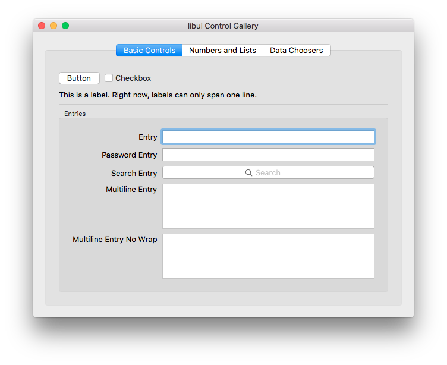

# libui: a portable GUI library for C

This README is being written.<br>
[](https://travis-ci.org/andlabs/libui)

## Announcements

* **18 March 2018**
	* Introduced an all-new formatted text API that allows you to process formatted text in ways that the old API wouldn't allow. You can read on the whole API [here](https://github.com/andlabs/libui/blob/8944a3fc5528445b9027b1294b6c86bae03eeb89/ui_attrstr.h). There is also a new examples for it: `drawtext`, which shows the whole API at a glance. It doesn't yet support measuring or manipulating text, nor does it currently support functions that would be necessary for things like text editors; all of this will be added back later.
	* libui also now uses my [utf library](https://github.com/andlabs/utf) for UTF-8 and UTF-16 processing, to allow consistent behavior across platforms. This usage is not completely propagated throughout libui, but the Windows port uses it in most places now, and eventually this will become what libui will use throughout.
	* Also introduced a formal set of contribution guidelines, see `CONTRIBUTING.md` for details. They are still WIP.

* **17 February 2018**
	* The longstanding Enter+Escape crashes on Windows have finally been fixed (thanks to @lxn).
	* **Alpha 3.5 is now here.** This is a quickie release primiarly intended to deploy the above fix to package ui itself. **It is a partial binary release; sorry!** More new things will come in the next release, which will also introduce semver (so it will be called v0.4.0 instead).
	* Alpha 3.5 also includes a new control gallery example. The screenshots below have not been updated yet.

* **27 November 2016**
	* Decided to split the table stuff into its own branch. It will be developed independently of everything else, along with a few other features.

* **2 November 2016**
	* Added two new functions to replace the deleted `uiWindowPosition()` and friends: `uiAreaBeginUserWindowMove()` and `uiAreaBeginUserWindowResize()`. When used in a `uiAreaHandler.Mouse()` event handler, these let you initiate a user-driven mouse move or mouse resize of the window at any point in a uiArea.

* **31 October 2016**
	* @krakjoe noticed that I accidentally used thread-unsafe code in uiQueueMain() on Unix. Fixed.

* **24 October 2016**
	* `uiWindowSetContentSize()` on Unix no longer needs to call up the GTK+ main loop. As a result, bugs related to strange behavior using that function (and the now-deleted `uiWindowSetPosition()` and `uiWindowCenter()`) should go away. I'll need to go through the bugs to verify as much, though.

* **22 October 2016**
	* Due to being unable to guarantee they will work (especially as we move toward capability-driven window systems like Wayland), or being unable to work without hacking that breaks other things, the following functions have been removed: `uiWindowPosition()`, `uiWindowSetPosition()`, `uiWindowCenter()`, and `uiWindowOnPositionChanged()`. Centering may come back at some point in the future, albeit in a possibly restricted form. A function to initiate a user move when a part of a uiArea is clicked will be provided soon.

* **21 October 2016**
	* `uiDrawTextWeightUltraBold` is now spelled correctly. Thanks to @krakjoe.

* **18 June 2016**
	* Help decide [the design of tables and trees in libui](https://github.com/andlabs/libui/issues/159); the implementation starts within the next few days, if not tomorrow!

* **17 June 2016**
	* **CMake 3.1.0 is now required.** This is due to CMake's rapid development pace in the past few years adding things libui needs to build on as many systems as possible. If your OS is supported by libui but its repositories ship with an older version of CMake, you will need to find an updated one somewhere.
	* Please help [plan out a better menu API](https://github.com/andlabs/libui/issues/152).

* **5 June 2016**
	* **Alpha 3.1 is here.** This was a much-needed update to Alpha 3 that changes a few things:
		* **The build system is now cmake.** cmake 2.8.11 or higher is needed.
		* Static linking is now fully possible.
		* MinGW linking is back, but static only.

*Old announcements can be found in the ANNOUNCE.md file.*

## Updates

*Note that today's entry (Eastern Time) may be updated later today.*

* **17 June 2016**
	* `uiMainSteps()` no longer takes any arguments and no longer needs to invoke a function to do the work. You still need to call it, but once you do, it will return immediately and you can then get right to your main loop.
	* **CMake 3.1.0 is now required.** This is due to CMake's rapid development pace in the past few years adding things libui needs to build on as many systems as possible. If your OS is supported by libui but its repositories ship with an older version of CMake, you will need to find an updated one somewhere.
	* Added `uiNewVerticalSeparator()` to complement `uiNewHorizontalSeparator()`.

* **16 June 2016**
	* Added `uiWindowContentSize()`, `uiWindowSetContentSize()`, and `uiWindowOnContentSizeChanged()` methods for manipulating uiWindow content sizes. Note the use of "content size"; the size you work with does NOT include window decorations (titlebars, menus, etc.).
	* Added `uiWindowFullscreen()` and `uiWindowSetFullscreen()` to allow making fullscreen uiWindows, taking advantage of OS facilities for fullscreen and without changing the screen resolution (!).
	* Added `uiWindowBorderless()` and `uiWindowSetBorderless()` for allowing borderless uiWindows.
	* Added `uiMainSteps()`. You call this instead of `uiMain()` if you want to run the main loop yourself. You pass in a function that will be called; within that function, you call `uiMainStep()` repeatedly until it returns 0, doing whatever you need to do in the meantime. (This was needed because just having `uiMainStep()` by itself only worked on some systems.)
	* Added `uiProgressBarValue()` and allowed passing -1 to `uiProgressBarSetValue()` to make an indeterminate progress bar. Thanks to @emersion.

* **15 June 2016**
	* Added `uiFormDelete()`; thanks to @emersion.
	* Added `uiWindowPosition()`, `uiWindowSetPosition()`, `uiWindowCenter()`, and `uiWindowOnPositionChanged()`, methods for manipulating uiWindow position.

* **14 June 2016**
	* uiDarwinControl now has a `ChildVisibilityChanged()` method and a corresponding `NotifyVisibilityChanged()` function that is called by the default show/hide handlers. This is used to make visibility changes work on OS X; uiBox, uiForm, and uiGrid all respect these now.
	* The same has been done on the Windows side as well.
	* Hiding and showing controls and padding calculations are now correct on Windows at long last.
	* Hiding a control in a uiForm now hides its label on all platforms.

* **13 June 2016**
	* `intmax_t` and `uintmax_t` are no longer used for libui API functions; now we use `int`. This should make things much easier for bindings. `int` should be at least 32 bits wide; this should be sufficient for all but the most extreme cases.

* **12 June 2016**
	* Added `uiGrid`, a new container control that arranges controls in rows and columns, with stretchy ("expanding") rows, stretchy ("expanding") columns, cells that span rows and columns, and cells whose content is aligned in either direction rather than just filling. It's quite powerful, is it? =P

* **8 June 2016**
	* Added `uiForm`, a new container control that arranges controls vertically, with properly aligned labels on each. Have fun!

* **6 June 2016**
	* Added `uiRadioButtonsSelected()`, `uiRadioButtonsSetSelected()`, and `uiRadioButtonsOnSelected()` to control selection of a radio button and catch an event when such a thing happens.

* **5 June 2016**
	* Added `uiNewPasswordEntry()`, which creates a new `uiEntry` suitable for entering passwords.
	* Added `uiNewSearchEntry()`, which creates a new `uiEntry` suitable for searching. On some systems, the `OnChanged()` event will be slightly delayed and/or combined, to produce a more natural feel when searching.

*Old updates can be found in the Changelog.md file.*

## Runtime Requirements

* Windows: Windows Vista SP2 with Platform Update or newer
* Unix: GTK+ 3.10 or newer
* Mac OS X: OS X 10.8 or newer

## Build Requirements

* All platforms:
	* CMake 3.1.0 or newer
* Windows: either
	* Microsoft Visual Studio 2013 or newer (2013 is needed for `va_copy()`) — you can build either a static or a shared library
	* MinGW-w64 (other flavors of MinGW may not work) — **you can only build a static library**; shared library support will be re-added once the following features come in:
		* [Isolation awareness](https://msdn.microsoft.com/en-us/library/aa375197%28v=vs.85%29.aspx), which is how you get themed controls from a DLL without needing a manifest
* Unix: nothing else specific
* Mac OS X: nothing else specific, so long as you can build Cocoa programs

## Building

Out-of-tree builds typical of cmake are preferred:

```
$ # you must be in the top-level libui directory, otherwise this won't work
$ mkdir build
$ cd build
$ cmake ..
```

Pass `-DBUILD_SHARED_LIBS=OFF` to `cmake` to build a static library. The standard cmake build configurations are provided; if none is specified, `Debug` is used.

If you use a makefile generator with cmake, then

```
$ make
$ make tester         # for the test program
$ make examples       # for examples
```

and pass `VERBOSE=1` to see build commands. Build targets will be in the `build/out` folder.

Project file generators should work, but are untested by me.

On Windows, I use the `Unix Makefiles` generator and GNU make (built using the `build_w32.bat` script included in the source and run in the Visual Studio command line). In this state, if MinGW-w64 (either 32-bit or 64-bit) is not in your `%PATH%`, cmake will use MSVC by default; otherwise, cmake will use with whatever MinGW-w64 is in your path. `set PATH=%PATH%;c:\msys2\mingw(32/64)\bin` should be enough to temporarily change to a MinGW-w64 build for the current command line session only if you installed MinGW-w64 through [MSYS2](https://msys2.github.io/); no need to change global environment variables constantly.

## Installation

#### Arch Linux

Can be built from AUR: https://aur.archlinux.org/packages/libui-git/

## Documentation

Needs to be written. Consult `ui.h` and the examples for details for now.

## Language Bindings

libui was originally written as part of my [package ui for Go](https://github.com/andlabs/ui). Now that libui is separate, package ui has become a binding to libui. As such, package ui is the only official binding.

Other people have made bindings to other languages:

Language | Bindings
--- | ---
C# / .NET Framework | [LibUI.Binding](https://github.com/NattyNarwhal/LibUI.Binding)
C# / .NET Core | [DevZH.UI](https://github.com/noliar/DevZH.UI), [SharpUI](https://github.com/benpye/sharpui/)
CHICKEN Scheme | [wasamasa/libui](https://github.com/wasamasa/libui)
Crystal | [libui.cr](https://github.com/Fusion/libui.cr)
D | [DerelictLibui (flat API)](https://github.com/Extrawurst/DerelictLibui), [libuid (object-oriented)](https://github.com/mogud/libuid)
Euphoria | [libui-euphoria](https://github.com/ghaberek/libui-euphoria)
Harbour | [HBUI](https://github.com/RJopek/HBUI)
Haskell | [libui-haskell](https://github.com/ajnsit/libui-haskell), [beijaflor-io/haskell-libui (complete FFI bindings, extensions and higher-level API)](https://github.com/beijaflor-io/haskell-libui)
JavaScript | [libui.js (merged into libui-node?)](https://github.com/mavenave/libui.js)
Julia | [Libui.jl](https://github.com/joa-quim/Libui.jl)
Lua | [libuilua](https://github.com/zevv/libuilua), [libui-lua](https://github.com/mdombroski/libui-lua)
Nim | [ui](https://github.com/nim-lang/ui)
Node.js | [libui-node](https://github.com/parro-it/libui-node)
PHP | [ui](https://github.com/krakjoe/ui)
Python | [pylibui](https://github.com/joaoventura/pylibui)
Ruby | [libui-ruby](https://github.com/jamescook/libui-ruby)
Rust | [libui-rs](https://github.com/pcwalton/libui-rs)
Swift | [libui-swift](https://github.com/sclukey/libui-swift)

## Frequently Asked Questions

### Why does my program start in the background on OS X if I run from the command line?
OS X normally does not start program executables directly; instead, it uses [Launch Services](https://developer.apple.com/reference/coreservices/1658613-launch_services?language=objc) to coordinate the launching of the program between the various parts of the system and the loading of info from an .app bundle. One of these coordination tasks is responsible for bringing a newly launched app into the foreground. This is called "activation".

When you run a binary directly from the Terminal, however, you are running it directly, not through Launch Services. Therefore, the program starts in the background, because no one told it to activate! Now, it turns out [there is an API](https://developer.apple.com/reference/appkit/nsapplication/1428468-activateignoringotherapps) that we can use to force our app to be activated. But if we use it, then we'd be trampling over Launch Services, which already knows whether it should activate or not. Therefore, libui does not step over Launch Services, at the cost of requiring an extra user step if running directly from the command line.

See also [this](https://github.com/andlabs/libui/pull/20#issuecomment-211381971) and [this](http://stackoverflow.com/questions/25318524/what-exactly-should-i-pass-to-nsapp-activateignoringotherapps-to-get-my-appl).

## Contributing

See `CONTRIBUTING.md`.

## Screenshots

From examples/controlgallery:



